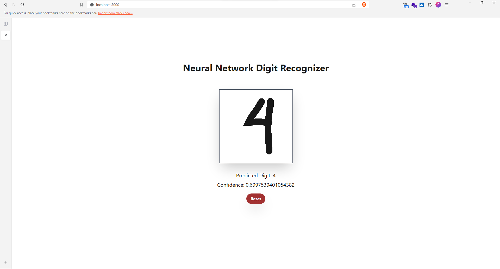

# Digit Recognizer from Scratch + Web UI



## Introduction

Welcome to the Digit Recognizer project, a comprehensive implementation of a handwritten digit recognition system from scratch using Python and PyTorch. The core of this project is a Convolutional Neural Network (CNN) model trained on the MNIST dataset, a widely used benchmark for image classification tasks. Our model employs the popular ResNet architecture, which is known for its exceptional performance and scalability.

The project originated as a part of the mid-term project for the Artificial Intelligence course at the esteemed State University of Surabaya. It offers a real-world application of machine learning and web development, seamlessly blending the two domains.

## Key Features
- State-of-the-Art Accuracy: Our model has been meticulously trained and tested on the MNIST dataset, achieving an impressive accuracy of 99.01% on the test set. This high accuracy demonstrates the model's ability to recognize handwritten digits with exceptional precision.

- Web User Interface: We've gone a step further by developing a user-friendly web interface to showcase the digit recognition capabilities. This allows users to draw or input handwritten digits and witness the model's recognition accuracy in real-time.

- Seamless Deployment: The model and web interface are seamlessly integrated using Flask, a powerful web framework for Python. You can run the web application locally on your machine, offering an interactive experience.

## How to run
Follow these steps to set up and run the Digit Recognizer project on your local machine:

1. **Clone the Repository**: Begin by cloning this repository to your local machine.
2. **Navigate to the Web App Directory**: Change your working directory to the "web-app" folder within the cloned repository.
    ```bash
    cd web-app
    ```

3. **Install Dependencies**: To ensure all necessary dependencies are installed, run the following commands. This will take care of both frontend and backend dependencies.

    ```bash
    npm install && npm run setup
    ```

4. **Run** the **Backend**
    ```bash
    npm run be
    ```

5. **Run** the **Frontend**
    ```bash
    npm run fe
    ```

6. Access the Web Interface: Open your web browser and visit http://localhost:3000 to start using the Digit Recognizer.
